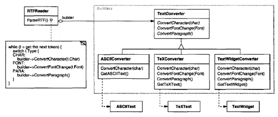
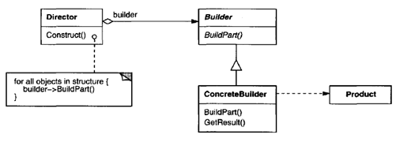
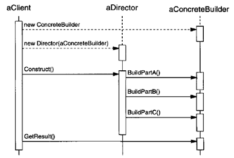

.. contents:: Table of Contents

Builder
=======

Intent
------

Separate the construction of a complex object from its representation so that the same construction process can create different representations.

Motivation
----------

We want to construct a complex object; however, we do not want to have a complex constructor member or one that would need many arguments.
Define an intermediate object whose member functions define the desired object part by part before the object is available to the client. Builder Pattern lets us defer the construction of the object until all the options for creation have been specified.
Builder design pattern describes how to solve such problems:
- Encapsulate creating and assembling the parts of a complex object in a separate Builder object.
- A class delegates object creation to a Builder object instead of creating the objects directly.

A reader for the RTF (Rich Text Format) document exchange format should be able to convert RTF to many text formats. The problem, however, is that the number of possible conversions is open-ended. So, it should be easy to add a new conversion without modifying the reader.

A solution is to configure the RTFReader class with a TextConverter object that converts RTF to another textual representation.

Subclasses of TextConverter specialize in different conversions and formats.For example, an ASCIIConverter ignores requests to convert anything except plain text.

Each kind of converter class takes the mechanism for creating and assembling a complex object and puts it behind an abstract interface.The converter is separatefrom the reader, which is responsible for parsing an RTFdocument.

The Builder pattern captures all these relationships. Each converter class is called a builder in the pattern, and the reader is called the director.

Applied to this example, the Builder pattern separates the algorithm for interpreting a textual format from how a converted format gets created and represented. This lets us reuse the RTFReader's parsing algorithm to create different text representations from RTFdocuments—just configure the RTFReader with different subclasses of TextConverter.

Applicability
-------------

Use the Builder pattern when
- the algorithm for creating a complex object should be independent of the parts that make up the object and how they're assembled.
- the construction process must allow different representations for the object that's constructed.

Structure
---------

 
Participants
------------

Builder (TextConverter)
^^^^^^^^^^^^^^^^^^^^^^^

- specifies an abstract interface for creating parts of a Product object.

ConcreteBuilder (ASCIIConverter, TeXConverter, TextWidgetConverter)
^^^^^^^^^^^^^^^^^^^^^^^^^^^^^^^^^^^^^^^^^^^^^^^^^^^^^^^^^^^^^^^^^^^

- constructs and assembles parts of the product by implementing the Builder interface.
- defines and keeps track of the representation it creates.
- provides an interface for retrieving the product (e.g., GetASCIIText, GetTextWidget).

Director (RTFReader)
^^^^^^^^^^^^^^^^^^^^

- constructs an object using th eBui lderinterface.

Product (ASCIIText, TeXText, TextWidget)
^^^^^^^^^^^^^^^^^^^^^^^^^^^^^^^^^^^^^^^^

- represents th e complex object under construction. ConcreteBuilder builds the product's internal representation and defines the process by which it's assembled.
- includes classes that define the constituent parts, including interfaces for assembling the parts into the final result.

Collaborations
--------------

- The client creates the Director object and configures it with the desired Builder object.
- Director notifies the builder whenever a part of the product should be built.
- Builder handles requests from the director and adds parts to the product.
- The client retrieves the product from the builder.
The following interaction diagram illustrates how Builder and Director cooperate with a client.
 

Consequences
-------------

#. *It lets you vary a product's internal representation.* The Builder object provides the director with an abstract interface for constructing the product. The interface lets the builder hide the representation and internal structure of the product. It also hides how the product gets assembled.

#. *It isolates code for construction and representation.* The Builder pattern improves modularity by encapsulating the way a complex object is constructed and represented. Clients needn't know anything about the classes that define the product's internal structure; such classes don't appear in Builder's interface.

#. It gives you finer control over the construction process. Unlike creational patterns that construct products in one shot, the Builder pattern constructs the product step by step under the director's control. Only when the product is finished does the director retrieve it from the builder.

Implementation
--------------

Typically, there's an abstract Builder class that defines an operation for each component that a director may ask it to create. The operations do nothing by default. A Concrete Builder class overrides operations for components it's interested in creating.

Here are other implementation issues to consider:
#. Assembly and construction interface. Builder class interface must be general enough to allow the construction of products for all kinds of concrete builders.
A key design issue concerns the model for the construction and assembly process. A model where the results of construction requests are simply appended to the product is usually sufficient.
But sometimes you might need access to parts of the product constructed earlier. Tree structures such as parse trees that are built bottom-up are another example. In that case, the builder would return child nodes to the director, which then would pass them back to the builder to build the parent nodes.

#. Why no abstract class for products? In the common case, the products produced by the concrete builders differ so greatly in their representation that they are unlikely to have a common interface, nor do they need one. Because the client usually configures the director with the proper concrete builder, the client is in a position to know which concrete subclass of Builder is in use and can handle its products accordingly.

#. Empty methods as default in Builder. In C++, the build methods are intentionally not declared pure virtual member functions. They're defined as empty methods instead, letting clients override only the operations they're interested in.

Sample Code
------------

.. code:: cpp

	#include <iostream>
	#include <memory>
	#include <string>

	class Product {
	   public:
	    void set_part_a(const std::string& a) { m_a = a; }
	    void set_part_b(const std::string& b) { m_b = b; }
	    void set_part_c(const std::string& c) { m_c = c; }
	    void open() const {
		std::clog << "Product with part a " << m_a <<
		" Product with part b " << m_b <<
		" Product with part c " << m_c << '\n';
	    }

	   private:
	    std::string m_c;
	    std::string m_b;
	    std::string m_a;
	};

	// Abstract Builder
	class Builder {
	   public:
	    virtual ~Builder(){};

	    std::unique_ptr<Product> getProduct() { return std::move(m_up_product); }
	    void createNewProduct() { m_up_product = std::make_unique<Product>(); }
	    virtual void build_part_a() { };
	    virtual void build_part_b() { };
	    virtual void build_part_c() { };

	   protected:
	    std::unique_ptr<Product> m_up_product;
	};

	// concrete builder
	class ConcreteBuilder_1 : public Builder {
	   public:
	    virtual ~ConcreteBuilder_1(){};

	    virtual void build_part_a() { m_up_product->set_part_a("concrete builder-1-a"); }
	    virtual void build_part_b() { m_up_product->set_part_b("concrete builder-1-b"); }
	    virtual void build_part_c() { m_up_product->set_part_c("concrete builder-1-c"); }
	};

	// concrete builder
	class ConcreteBuilder_2 : public Builder {
	   public:
	    virtual ~ConcreteBuilder_2(){};
	    
	    virtual void build_part_a() { m_up_product->set_part_a("concrete builder-2-a"); }
	    virtual void build_part_b() { m_up_product->set_part_b("concrete builder-2-b"); }
	    virtual void build_part_c() { m_up_product->set_part_c("concrete builder-2-c"); }
	};

	// Director
	class Director {
	   public:
	    void openProduct() { mp_builder->getProduct()->open(); }
	    void makeProduct(Builder* pb) {
		mp_builder = pb;
		mp_builder->createNewProduct();
		mp_builder->build_part_a();
		mp_builder->build_part_b();
		mp_builder->build_part_c();
	    }

	   private:
	    Builder* mp_builder;
	};

	int main() {
	    Director Director;
	    ConcreteBuilder_1 ConcreteBuilder_1;
	    ConcreteBuilder_2 ConcreteBuilder_2;

	    Director.makeProduct(&ConcreteBuilder_1);
	    Director.openProduct();

	    Director.makeProduct(&ConcreteBuilder_2);
	    Director.openProduct();
	}

Known Uses
-----------

Related Patterns
----------------

Abstract Factory is similar to Builder in that it too may construct complex objects. The primary difference is that the Builder pattern focuses on constructing a complex object step by step. Abstract Factory's emphasis is on families of product objects (either simple or complex). Builder returns the product as a final step, but as far as the Abstract Factory pattern is concerned, the product gets returned immediately.

A Composite is what the builder often builds.

Advantages
----------

#. Allows you to vary a product’s internal representation
#. Encapsulates code for construction and representation
#. Provides control over steps of construction process

Disadvantages
-------------

#. Requires creating a separate ConcreteBuilder for each different type of product
#. Requires the builder classes to be mutable
#. Data members of class aren't guaranteed to be initialized
#. Dependency injection may be less supported

References
-----------

| Book: Design Patterns Elements of Reusable Object-Oriented Software
| Book: Head First: Design Patterns
| https://sourcemaking.com/design_patterns/builder
| https://en.wikipedia.org/wiki/Builder_pattern

