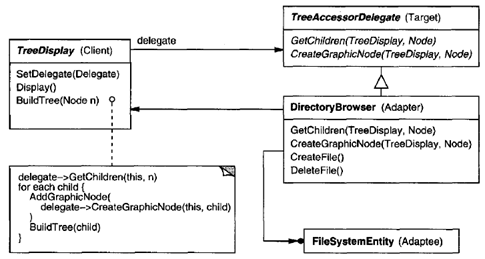

.. contents:: Table of Contents

Adapter
========

Intent
------

Convert the interface of a class into another interface clients expect.

Adapter lets classes work together that couldn't otherwise because of incompatible interfaces.

Often the adapter is responsible for functionality the adapted class doesn't provide.

An adapter often becomes necessary when you discover that two incompatible classes should work together, generally to avoid replicating code.

The Adapter pattern makes things work after they're designed.

An adapter makes two existing interfaces work together as opposed to defining an entirely new one.

Also Known As
------------

Wrapper

Motivation
-----------

Consider for example a drawing editor that lets users draw and arrange graphical elements (lines, polygons, text, etc.) into pictures and diagrams. 

The interface for graphical objects is defined by an abstract class called Shape. The editor defines a subclass of Shape for each kind of graphical object: a LineShape class for lines, a PolygonShape class for polygons, and so forth.

 
But a TextShape subclass that can display and edit text is considerably more difficult to implement, since even basic text editing involves complicated screen update and buffer management.

Another TextView class is present for displaying and editing text. Ideally we'd like to reuse TextView to implement TextShape, but the toolkit wasn't designed with Shape classes in mind. So we can't use TextView and Shape objects interchangeably.

We could define TextShape so that it adapts the TextView interface to Shape's. We can do this in one of two ways: 

#. By inheriting Shape's interface and TextView's implementation or 	(class Adapter)
#. By composing a TextView instance within a TextShape and implementing TextShape in terms of TextView's interface. (object Adapter)

Often the adapter is responsible for functionality the adapted class doesn't provide.

Applicability
-------------

Use the Adapter pattern when

- you want to use an existing class, and its interface does not match the one you need.
- you want to create a reusable class that cooperates with unrelated or unforeseen classes, that is, classes that don't necessarily have compatible interfaces.
- (Object adapter only) you need to use several existing subclasses, but it's unpractical to adapt their interface by subclassing everyone. An object adapter can adapt the interface of its parent class.	

Structure
---------

A class adapter uses multiple inheritance to adapt one interface to another
 

An object adapter relies on object composition
 

Participants
-------------

- **Target (Shape):** defines the domain-specific interface that Client uses.
- **Client (DrawingEditor):** collaborates with objects conforming to the Target interface.
- **Adaptee (TextView):** defines an existing interface that needs adapting.
- **Adapter (TextShape):** adapts the interface of Adaptee to the Target interface.

Collaborations
--------------

Clients call operations on an Adapter instance. In turn, the adapter calls Adaptee operations that carry out the request.

Consequences
------------

**A class adapter trade-off**

- a class adapter adapts a concrete Adaptee class to Target. As a consequence, a class adapter won't work when we want to adapt a class and all its subclasses.
- lets Adapter override some of Adaptee's behaviour, since Adapter is a subclass of Adaptee.
- introduces only one object, and no additional pointer indirection is needed to get to the adaptee.

**An object adapter trade-off**

- lets a single Adapter work with many Adaptees—that is, the Adaptee itself and all of its subclasses (if any). The Adapter can also add functionality to all Adaptees at once.
- makes it harder to override Adaptee behavior. It will require subclassing Adaptee and making Adapter refer to the subclass rather than the Adaptee itself.

Things to consider

1.	How much adapting does Adapter do?
^^^^^^^^^^^^^^^^^^^^^^^^^^^^^^^^^^^^

There is a spectrum of possible work, from simple interface conversion to supporting an entirely different set of operations.

2.	Pluggable adapters
^^^^^^^^^^^^^^^^^^^^^^^^^^

A class is more reusable when you minimize the assumptions other classes must mak e to use it . Bybuilding interface adaptation into a class, you eliminate the assumption that other classes see the same interface.

Consider a TreeDisplay widget that can display tree structures graphically. If this were a special-purpose widget for use in just one application, then we might require the objects that it displays to have a specific interface; that is, all must descend from a Tree abstract class.

But if we wanted to make TreeDisplay more reusable, then that requirement would be unreasonable. Applications will define their own classes for tree structures. They shouldn't be forced to use our Tree abstract class. Different tree structures will have different interfaces.

3.	Using two-way adapters to provide transparency
^^^^^^^^^^^^^^^^^^^^^^^^^^^^^^^^^^^^^^^^^^^^^^^^^^^

A potential problem with adapters is that they aren't transparent to all clients. An adapted object no longer conforms to the Adaptee interface, so it can't be used as is wherever an Adaptec object can. Two-way adapters can provide such transparency. Specifically, they're useful when two different clients need to view an object differently.

 
Implementation
--------------

1.	Class adapter
^^^^^^^^^^^^^^^^^

In C++, Adapter would inherit publicly from Target and privately from Adaptee. Thus Adapter would be a subtype of Target but not of Adaptee.

2.	Pluggable adapter
^^^^^^^^^^^^^^^^^^^^

Three ways to implement pluggable adapters for the TreeDisplay widget described earlier, which can lay out and display a hierarchical structure automatically

The first step, which is common to all three of the implementations discussed here, is to find a "narrow" interface for Adaptee, that is, the smallest subset of operations that lets us do the adaptation.

For TreeDisplay, the adaptee is any hierarchical structure. A minimalist interface might include two operations, one that defines how to present a node in the hierarchical structure graphically, and another that retrieves the node's children.

The narrow interface leads to three implementation approaches
	
A.	Using abstract operations
~~~~~~~~~~~~~~~~~~~~~~~~~~~~~

Define corresponding abstract operations for the narrow Adaptee interface in the TreeDisplay class. Subclasses must implement the abstract operations and adapt the hierarchically structured object. For example, a DirectoryTreeDisplay subclass will implement these operations by accessing the directory structure.

 
B.	Using delegate objects
~~~~~~~~~~~~~~~~~~~~~~~~~~~

In this approach, TreeDispl ay forwa rdsrequests for accessing the hierarchical structure to a delegate object. TreeDisp laycan use a different adaptation strateg y by substituting a different delegate.

 
Statically typed languages like C++ require an explicit interface definition for the delegate. We can specify such an interface by putting the narrow interface that TreeDisplay requires into an abstract TreeAccessorDelegate class. Then we can mix this interface into the delegate of our choice—DirectoryBrowser in this case—using inheritance. We use single inheritance if the DirectoryBrowser has no existing parent class, multiple inheritance if it does.	

C.	Parameterized adapters
~~~~~~~~~~~~~~~~~~~~~~~~~~

Parameterize an adapter with one or more blocks. The block construct supports adaptation without subclassing.

A block can adapt a request, and the adapter can store a block for each individual request.

If you're building interface adaptation into a class, this approach offers a convenient alternative to subclassing.

Sample Code
-----------

1.	Class Adapter
^^^^^^^^^^^^^^^^^

`Class Adapter code file <02_Structural_Patterns_01_Adapter_ClassAdapter.cpp>`_

.. code:: cpp

        /********
        Class Adapter
            A class adapter uses multiple inheritance to adapt interfaces. 
            Use one inheritance branch to inherit the interface and another branch to inherit the implementation. 
            In C++, inherit the interface publicly and inherit the implementation privately.

        ************/

        #include <iostream>
        #include <string>
        #include <cstdint>

        class SepecificDB {
            public:
                void initDB(std::string ip, uint32_t port) {
                    std::cout   << "Specific DB initializing with " 
                                << ip << ":" << port << '\n';
                }
        };

        class DBConnection {
            public:
                virtual void initialize(std::string, uint32_t)   = 0;
                virtual void connectDB() { }
        };

        class DBConnectionAdapter
            : public DBConnection, private SepecificDB {

            std::string      m_ip;
            uint32_t        m_port;
            public:
                virtual void initialize(std::string ip, uint32_t port) override { 
                    std::cout << "Initializing DB\n";
                    m_ip    = ip;
                    m_port  = port;
                };
                void connectDB() override {
                    initDB(m_ip, m_port);
                }
        };

        class MyApplication {
            DBConnection & db;
            public:
            MyApplication(DBConnection & db) : db(db) {}

            void connectWithDB() {
                db.connectDB();
            }
        };

        int main() {
            DBConnectionAdapter db_adapter;
            db_adapter.initialize("127.0.0.1", 4568);

            MyApplication myapp(db_adapter);
            myapp.connectWithDB();

            return 0;
        }

Output::

        Initializing DB
        Specific DB initializing with 127.0.0.1:4568

2.	Object Adapter
^^^^^^^^^^^^^^^^^^

`Object Adapter code file <02_Structural_Patterns_01_Adapter_ObjectAdapter.cpp>`_

.. code:: cpp

        /********
        Object Adapter
            The object adapter uses object composition to combine classes with different interfaces.
            The object adapter requires a little more effort to write, but it's more flexible. 
            
            The object adapter version of DBConnection will work equally well with subclasses of 
            SepecificDB. The client simply passes an instance of a SepecificDB subclass to the 
            DBConnection constructor.

        ************/

        #include <iostream>
        #include <string>
        #include <cstdint>

        class SepecificDB {
            public:
                void initDB(std::string ip, uint32_t port) {
                    std::cout   << "Specific DB initializing with " 
                                << ip << ":" << port << '\n';
                }
        };

        class DBConnection {
            public:
                virtual void initialize(std::string, uint32_t)   = 0;
                virtual void connectDB() { }
        };

        class DBConnectionAdapter 
            : public DBConnection {

            std::string     m_ip;
            uint32_t        m_port;

            SepecificDB & sdb;

            public:
                DBConnectionAdapter(SepecificDB & sdb) : sdb(sdb) { }
                virtual void initialize(std::string ip, uint32_t port) override { 
                    std::cout << "Initializing DB\n";
                    m_ip    = ip;
                    m_port  = port;
                };        
                void connectDB() override {
                    sdb.initDB(m_ip, m_port);
                }
        };

        class MyApplication {
            DBConnection & db;
            public:
            MyApplication(DBConnection & db) : db(db) {}

            void connectWithDB() {
                db.connectDB();
            }
        };

        int main() {
            SepecificDB sdb;
            DBConnectionAdapter db_adapter(sdb);
            db_adapter.initialize("127.0.0.1", 4568);

            MyApplication myapp(db_adapter);
            myapp.connectWithDB();

            return 0;
        }

Output::

        Initializing DB
        Specific DB initializing with 127.0.0.1:4568

Known Uses
----------

Meyer's "Marriage of Convenience" [Mey88] is a form of class adapter. Meyer describes how a FixedStack class adapts the implementation of an Array class to the interface of a Stack class. The result is a stack containing a fixed number of entries.

Related Patterns
----------------

- Bridge has a different intent: It is meant to separate an interface from its implementation so that they can be varied easily and independently. An adapter is meant to change the interface of an existing object.
- Decorator enhances another object without changing its interface. A decorator is thus more transparent to the application than an adapter is. As a consequence, Decora tor supports recursive composition, which isn't possible with pure adapters.
- Proxy defines a representative or surrogate for another object and does not change its interface.
- Facade defines a new interface, whereas Adapter reuses an old interface. Remember that Adapter makes two existing interfaces work together as opposed to defining an entirely new one.
- Adapter provides a different interface to its subject. Decorator provides an enhanced interface. Proxy provides the same interface.

References
-----------

Book: Design Patterns Elements of Reusable Object-Oriented Software

