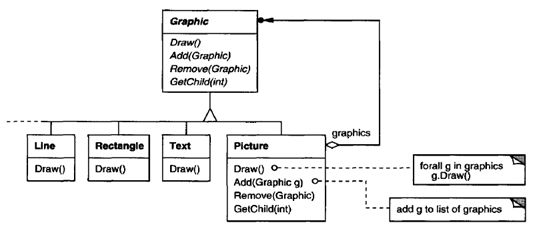
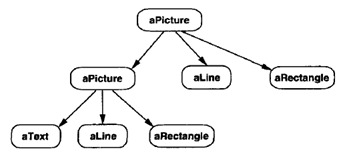
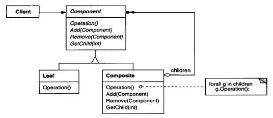
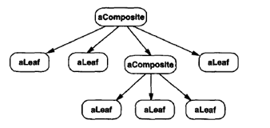

.. contents:: Table of Contents

Composite
=========

Intent
--------

Compose objects into tree structures to represent part-whole hierarchies. Composite lets clients treat individual objects and compositions of objects uniformly.

Composite focuses on structuring classes so that many related objects can be treated uniformly, and multiple objects can be treated as one. Its focus is not on embellishment but on representation.

Motivation
-----------

Graphics applications like drawing editors and schematic capture systems let users build complex diagrams out of simple components. A simple implementation could define classes for graphical primitives such as Text and Lines plus other classes that act as containers for these primitives.

Issue: Code that uses these classes must treat primitive and container objects differently, even if most of the time the user treats them identically. The Composite pattern describes how to use recursive composition so that clients don't have to make this distinction.

 
**The key to the Composite pattern is an abstract class that represents both primitives and their containers.**

For the graphics system, this class is Graphic. Graphic declares operations like Draw that are specific to graphical objects. It also declares operations that all composite objects share, such as operations for accessing and managing its children.

The subclasses Line, Rectangle, and Text define primitive graphical objects. Since primitive graphics have no child graphics, none of these subclasses implements child-related operations.

The Picture class defines an aggregate of Graphic objects. Because the Picture interface conforms to the Graphic interface, Picture objects can compose other Pictures recursively.

Following is a typical composite object structure of recursively composed Graphic objects:

 
Applicability
-------------

Use the Composite pattern when

- you want to represent part-whole hierarchies of objects.
- you want clients to be able to ignore the difference between compositions of objects and individual objects. Clients will treat all objects in the composite structure uniformly.

Structure
---------

 
A typical Composite object structure might look like this

 
Participants
------------

**Component (Graphic)**

- declares the interface for objects in the composition.
- implements default behavior for the interface common to all classes, as appropriate.
- declares an interface for accessing and managing its child components.
- (optional) defines an interface for accessing a component's parent in the recursive structure, and implements it if that's appropriate.

**Leaf (Rectangle, Line, Text etc,.)**

- represents leaf objects in the composition. A leaf has no children.
- defines behavior for primitive objects in the composition.

**Composite (Picture)**

- defines behavior for components having children.
- stores child components.
- implements child-related operations in the Component interface.

**Client**

- manipulates objects in the composition through the Component interface.

Collaborations
---------------

Clients use the Component class interface to interact with objects in the composite structure. 

If the recipient is a Leaf, then the request is handled directly. 

If the recipient is a Composite, then it usually forwards requests to its child components, possibly performing additional operations before and/or after forwarding.

Consequences
------------

The Composite pattern

- **defines class hierarchies.** Primitive objects can be composed into more complex objects, which in turn can be composed, and so on recursively. Wherever client code expects a primitive object, it can also take a composite object.

- **makes the client simple.** Clients normally don't know (and shouldn't care) whether they're dealing with a leaf or a composite component.

- **makes it easier to add new kinds of components.** Newly defined Composite or Leaf subclasses work automatically with existing structures and client code.

- **can make your design overly general.** The disadvantage of making it easy to add new components is that it makes it harder to restrict the components of a composite. Sometimes you want a composite to have only certain components. With Composite, you can't rely on the type system to enforce those constraints for you. You'll have to use run-time checks instead.

Implementation
---------------

Issues to consider when implementing the Composite pattern:

1.	Explicit parent references
^^^^^^^^^^^^^^^^^^^^^^^^^^^^^^

Maintaining references from child components to their parent

- can simplify the traversal and management of a composite structure
- simplifies moving up the structure and deleting a component
- also help support the Chain of Responsibility pattern

The usual place to define the parent reference is in the Component class. Leaf and Composite classes can inherit the reference and the operations that manage it.

2.	Sharing components
^^^^^^^^^^^^^^^^^^^^^

It's often useful to share components, for example, to reduce storage requirements. But when a component can have no more than one parent, sharing components becomes difficult. 

A possible solution is for children to store multiple parents. But that can lead to ambiguities as a request propagates up the structure. 

The Flyweight pattern shows how to rework a design to avoid storing parents altogether. It works in cases where children can avoid sending parent requests by externalizing some or all of their state.

3.	Maximizing the Component interface
^^^^^^^^^^^^^^^^^^^^^^^^^^^^^^^^^^^^^

To make clients unaware of the specific Leaf or Composite classes they're using, the Component class should define as many common operations for Composite and Leaf classes as possible. The Component class usually provides default implementations for these operations, and Leaf and Composite subclasses will override them.

There are many operations, like the interface for accessing children, that Component supports that don't seem to make sense for Leaf classes. How can Component provide a default implementation for them?

Remedy is, we can define a default operation for child access in the Component class that never returns any children. Leaf classes can use the default implementation, but Composite classes will reimplement it to return their children.

4.	Declaring the child management operations
^^^^^^^^^^^^^^^^^^^^^^^^^^^^^^^^^^^^^^^^^^^

An important issue in the Composite pattern is which classes declare the operations to manage child in the Composite class hierarchy, Component or Composite?

The decision involves a trade-off between safety and transparency:

- Defining the child management interface at the root of the class hierarchy gives you transparency, because you can treat all components uniformly. It costs you safety, however, because clients may try to do meaningless things like add and remove objects from leaves.
  
  In this case Usually it's better to make the operations to manage child fail by default (perhaps by raising an exception) if the component isn't allowed to have children or if the argument of Remove isn't a child of the component, respectively.

- Defining child management in the Composite class gives you safety, because any attempt to add or remove objects from leaves will be caught at compile-time in a statically typed language like C++. But you lose transparency, because leaves and composites have different interfaces.

We have emphasized transparency over safety in this pattern.

If you opt for safety, then at times you may lose type information and have to convert a component into a composite. How can you do this without resorting to a type-unsafe cast?

One approach is to declare an operation Composite* GetComposite ( ) in the Component class. Component provides a default operation that returns a null pointer. The Composite class redefines this operation to return itself through the this pointer.

Similar tests for a Composite can be done using the C++ dynamic-cast construct.

.. code:: cpp

        #include <iostream>
        #include <vector>

        class Composite;

        class Component {
            public:
                virtual ~Component() {}
                virtual void        display()           = 0;
                virtual Composite*  getComposite()      { return nullptr; }
        };

        class Composite : public Component {
                std::vector<Component *> m_cmp_con;
                public:
                virtual ~Composite() {}
                virtual void display() override   {
                    for(auto & elem : m_cmp_con) 
                        elem->display();
                }
                virtual Composite*  getComposite() { return this;}        

                // child operations inside Composite only for safety
                virtual void add(Component * cmp) { 
                    m_cmp_con.push_back(cmp);
                    return ;
                }        
                virtual Component*  child(int idx) { return m_cmp_con[idx]; };
                
        };

        class Leaf : public Component {
            int m_id;
            public:
            Leaf(int id) : m_id(id) { }
            virtual void display() override {
                std::cout << "Leaf - " << m_id << " execution\n";
            }
        };

        int main() {
            Component * lp_component = nullptr;

            Composite * lp_composite_1 = new Composite;
            Composite * lp_composite_2 = new Composite;
            Leaf        * lp_leaf_1   = new Leaf(1);
            Leaf        * lp_leaf_2   = new Leaf(2);
            Leaf        * lp_leaf_3   = new Leaf(3);

            Composite * temp_comp = nullptr;

            lp_component = lp_composite_1;
            if(temp_comp = lp_component->getComposite(); nullptr != temp_comp) {
                temp_comp->add(lp_leaf_1);
                temp_comp->add(lp_composite_2);
            }
            std::cout << "=== Display composite - 1 ===\n";
            lp_component->display();

            // following will not add
            lp_component = lp_leaf_2;
            if(temp_comp = lp_component->getComposite(); nullptr != temp_comp) {
                temp_comp->add(lp_leaf_3);
            }

            lp_component = lp_composite_1->child(1);
            if(temp_comp = lp_component->getComposite(); nullptr != temp_comp) {
                temp_comp->add(lp_leaf_2);
                temp_comp->add(lp_leaf_3);
            }
            std::cout << "=== Display composite - 1's child ===\n";
            lp_component->display();

            std::cout << '\n';
            lp_component = lp_composite_1;
            std::cout << "=== Display complete structure ===\n";
            lp_component->display();

            std::cout << '\n';
            std::cout << "=== Using dynamic_cast<Composite *> to check whether object is a Composite or not ===\n";
            {
                Composite * temp_comp = dynamic_cast<Composite *>(lp_composite_1);
                if(nullptr == temp_comp) {
                    std::cout << "dynamic_cast<Composite *>(lp_composite_1) returns nullptr\n";
                } else {
                    std::cout << "dynamic_cast<Composite *>(lp_composite_1) returns a pointer value\n";
                }
            }

            {
                Composite * temp_comp = dynamic_cast<Composite *>(lp_leaf_3);
                if(nullptr == temp_comp) {
                    std::cout << "dynamic_cast<Composite *>(lp_leaf_3) returns nullptr\n";
                } else {
                    std::cout << "dynamic_cast<Composite *>(lp_leaf_3) returns a pointer value\n";
                }
            }

            delete lp_composite_1;   lp_composite_1 = nullptr;
            delete lp_composite_2;   lp_composite_2 = nullptr;

            delete lp_leaf_1; lp_leaf_1 = nullptr;
            delete lp_leaf_2; lp_leaf_2 = nullptr;
            delete lp_leaf_3; lp_leaf_3 = nullptr;

            return 0;
        }

Output::

        === Display composite - 1 ===
        Leaf - 1 execution
        === Display composite - 1's child ===
        Leaf - 2 execution
        Leaf - 3 execution

        === Display complete structure ===
        Leaf - 1 execution
        Leaf - 2 execution
        Leaf - 3 execution

        === Using dynamic_cast<Composite *> to check whether object is a Composite or not ===
        dynamic_cast<Composite *>(lp_composite_1) returns a pointer value
        dynamic_cast<Composite *>(lp_leaf_3) returns nullptr

5.	Should Component implement a list of Components?
^^^^^^^^^^^^^^^^^^^^^^^^^^^^^^^^^^^^^^^^^^^^^

Putting the child pointer in the base class incurs a space penalty for every leaf, even though a leaf never has children. This is worthwhile only if there are relatively few children in the structure.

6.	Child ordering
^^^^^^^^^^^^^^^^^

When child ordering is an issue, you must design child access and management interfaces carefully to manage the sequence of children. The Iterator pattern can guide you in this.

7.	Caching to improve performance
^^^^^^^^^^^^^^^^^^^^^^^^^^^

The Composite can cache actual results or just information that lets it short-circuit the traversal or search.

8.	Who should delete components?
^^^^^^^^^^^^^^^^^^^^^^^^^^^^

In languages without garbage collection, it's usually best to make a Composite responsible for deleting its children when it's destroyed. An exception to this rule is when Leaf objects are immutable and thus can be shared.

9.	What's the best data structure for storing components?
^^^^^^^^^^^^^^^^^^^^^^^^^^^^^^^^^^^^^^^^^^^^^^

Composites may use linked lists, trees, arrays, and hash tables etc.... The choice of data structure depends (as always) on efficiency.

Sometimes composites have a variable for each child, although this requires each subclass of Composite to implement its own management interface. See Interpreter for an example.

Sample Code
-----------

`Composite Paatern - Safety Preferred over Transparency code file <02_Structural_Patterns_03_Composite_SafetyPreferred.cpp>`_

`Composite Paatern - Transparency Preferred over Safety code file <02_Structural_Patterns_03_Composite_TransparencyPreferred.cpp>`_

.. code:: cpp

        /*********    
            In this example transparency is preferred over safety

            Child management interface is present in Component class
            Line and Composite have same interfaces
        **************/

        #include <iostream>
        #include <vector>

        class Component {
            public:
                virtual ~Component() {}
                virtual void        display()           = 0;
                virtual void        add(Component * ) { return ; }
                virtual Component*  child(int ) { return nullptr; }
        };

        class Composite : public Component {
                std::vector<Component *> m_cmp_con;
                public:
                virtual ~Composite() {}
                
                virtual void display() override   {
                    for(auto & elem : m_cmp_con) 
                        elem->display();
                }

                virtual void add(Component * cmp) { 
                    m_cmp_con.push_back(cmp);
                    return ;
                }
                virtual Component*  child(int idx) { return m_cmp_con[idx]; };
                
        };

        class Line : public Component {
            int m_id;
            public:
            Line(int id) : m_id(id) { }
            virtual void display() override {
                std::cout << "Line - " << m_id << '\n';
            }
        };

        class Circle : public Component {
            int m_id;
            public:
            Circle(int id) : m_id(id) { }
            virtual void display() override {
                std::cout << "Circle - " << m_id << '\n';
            }
        };

        int main() {
            /*
                            Comosite-1
                            /       \
                        Line-1      Composite-2
                                    /        \
                                Line-2      Circle-1
            
            */
            Component * lp_component = nullptr;

            Composite   * lp_composite_1    = new Composite;
            Composite   * lp_composite_2    = new Composite;

            Line        * lp_line_1         = new Line(1);
            Line        * lp_line_2         = new Line(2);

            Circle      * lp_crcl_1         = new Circle(1);

            lp_component = lp_composite_1;
            if(nullptr != lp_component) {
                lp_component->add(lp_line_1);
                lp_component->add(lp_composite_2);
            }
            std::cout << "=== Display composite - 1 ===\n";
            lp_component->display();

            // following will not add
            lp_component = lp_line_2;
            if(nullptr != lp_component) {
                lp_component->add(lp_crcl_1);
            }

            lp_component = lp_composite_1->child(1);
            if(nullptr != lp_component) {
                lp_component->add(lp_line_2);
                lp_component->add(lp_crcl_1);
            }

            std::cout << "=== Display composite - 1's child ===\n";
            lp_component->display();

            std::cout << '\n';
            lp_component = lp_composite_1;
            std::cout << "=== Display complete structure ===\n";
            lp_component->display();

            delete lp_composite_1;   lp_composite_1 = nullptr;
            delete lp_composite_2;   lp_composite_2 = nullptr;

            delete lp_line_1; lp_line_1 = nullptr;
            delete lp_line_2; lp_line_2 = nullptr;
            delete lp_crcl_1; lp_crcl_1 = nullptr;

            return 0;
        }

Output::

        === Display composite - 1 ===
        Line - 1
        === Display composite - 1's child ===
        Line - 2
        Circle - 1

        === Display complete structure ===
        Line - 1
        Line - 2
        Circle - 1

Known Uses
--------

Composite pattern occurs in the financial domain, where a portfolio aggregates individual assets. You can support complex aggregations of assets by implementing a portfolio as a Composite that conforms to the interface of an individual asset.

The Command pattern describes how Command objects can be composed and sequenced with a MacroCommand Composite class.

Related Patterns
---------------

- Often the component-parent link is used for a Chain of Responsibility.

- Decorator is often used with Composite. When decorators and composites are used together, they will usually have a common parent class. So decorators will have to support the Component interface with operations like Add, Remove, and GetChild.

- Flyweight lets you share components, but they can no longer refer to their parents.

- Iterator can be used to traverse composites.

- Visitor localizes operations and behavior that would otherwise be distributed across Composite and Leaf classes.

References
----------

Book: Design Patterns Elements of Reusable Object-Oriented Software

