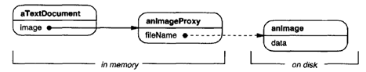
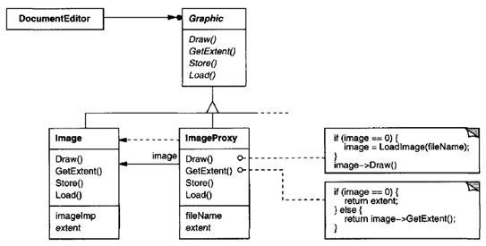
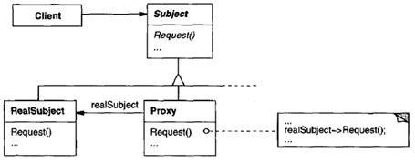
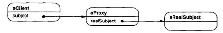

.. contents:: Table of Contents

Proxy
======

Intent
------

Provide a surrogate or placeholder for another object to control access to it.

One reason for controlling access to an object is to defer the full cost of its creation and initialization until we actually need to use it.

In the Proxy pattern, the subject defines the key functionality, and the proxy provides (or refuses) access to it.

Also Known As
-------------

Surrogate

Motivation
-----------

Consider a document editor that can embed graphical objects in a document. Some graphical objects, like large raster images, can be expensive to create. But opening a document should be fast, so we should avoid creating all the expensive objects at once when the document is opened. These constraints would suggest creating each expensive object on demand, which in this case occurs when an image becomes visible.

 
But what do we put in the document in place of the image?

The solution is to use another object, an image proxy, that acts as a stand-in for the real image. The proxy acts just like the image and takes care of instantiating it when it's required. The proxy also stores its extent, that is, its width and height. The extent lets the proxy respond to requests for its size from the formatter without actually instantiating the image.

ImageProxy also stores the bounding box of the image and a reference to the real Image instance. This reference won't be valid until the proxy instantiates the real image. The Draw operation makes sure the image is instantiated before forwarding it the request.

Applicability
----------------

Proxy is applicable whenever there is a need for a more versatile or sophisticated reference to an object than a simple pointer.

#. A **virtual proxy** creates expensive objects on demand.
#. A **remote proxy** provides a local representative for an object in a different address space.
#. A **protection proxy** controls access to the original object. Protection proxies are useful when objects should have different access rights.
#. A **smart reference** is a replacement for a bare pointer that performs additional actions when an object is accessed. Typical uses include

        - counting the number of references to the real object so that it can be freed automatically when there are no more references (also called smart pointers).
        - loading a persistent object into memory when it's first referenced.
        - checking that the real object is locked before it's accessed to ensure that no other object can change it.

Structure
----------
 

A possible object diagram of a proxy structure at run-time:

 
Participants
------------

**Subject(Graphic):** defines the common interface for RealSubject and Proxy so that a Proxy can be used anywhere a RealSubject is expected.

**RealSubject(Image):** defines the real object that the proxy represents.

**Proxy (ImageProxy):**

- maintains a reference that lets the proxy access the real subject
- provides an interface identical to Subject's so that a proxy can be substituted for the real subject
- controls access to the real subject and may be responsible for creating and deleting it
- virtual proxies may cache additional information about the real subject so that they can postpone accessing it
- remote proxies are responsible for encoding a request and its arguments and for sending the encoded request to the real subject in a different address space
- protection proxies check that the caller has the access permissions required to perform a request

Collaborations
---------------

Proxy forwards requests to RealSubject when appropriate, depending on the kind of proxy.

Consequences
------------

The Proxy pattern introduces a level of indirection when accessing an object.

Additional indirection has many uses

- A virtual proxy can perform optimizations such as creating an object on demand.
- A remote proxy can hide the fact that an object resides in a different address space.
- Both protection proxies and smart references allow additional housekeeping tasks when an object is accessed.

There's another optimization that the Proxy pattern can hide from the client. It's called **copy-on-write**. Copying a large and complicated object can be an expensive operation. If the copy is never modified, then there's no need to incur this cost. By using a proxy to postpone the copying process, we ensure that we pay the price of copying the object only if it's modified.

To make copy-on-write work, the subject must be reference counted. Copying the proxy will do nothing more than increment this reference count. Only when the client requests an operation that modifies the subject does the proxy actually copy it. In that case the proxy must also decrement the subject's reference count. When the reference count goes to zero, the subject gets deleted.

Implementation
--------------

1.	Overloading the member access operator ((-> and \*) ) in C++
^^^^^^^^^^^^^^^^^^^^^^^^^^^^^^^^^^^^^^^^^^^^^^^^^^^^^^^^^^^^^^^^

Overloading this operator lets you perform additional work whenever an object is dereferenced. This can be helpful for implementing some kinds of proxy; the proxy behaves just like a pointer.

Overloading the member access operator isn't a good solution for every kind of proxy. Some proxies need to know precisely which operation is called, and overloading the member access operator doesn't work in those cases.

Following example illustrates how to use this technique to implement a virtual proxy called ImagePtr.

.. code:: cpp

        class Image;
        extern Image* LoadAnlmageFile(const char*);
        // external function

        class ImagePtr {
           public:
            ImagePtr(const char* imageFile);
            virtual ~ImagePtr();

            virtual Image* operator->();
            virtual Image& operator*();

           private:
            Image* Loadlmage();

           private:
            Image* _image;
            const char* _imageFile;
        };

        ImagePtr::ImagePtr(const char* thelmageFile) {
            _imageFile = thelmageFile;
            _image = 0;
        }

        Image* ImagePtr::Loadlmage() {
            if (_image == 0) {
                _image = LoadAnlmageFile(_imageFile);
            }
            return _image;
        }

        // //////////
        // The overloaded -> and * operators use Loadlmage to 
        // return _image to callers (loading it if necessary).
        // //////////
        Image* ImagePtr::operator->() { return Loadlmage(); }
        Image& ImagePtr::operator*() { return *LoadImage(); }

        // //////////
        // This approach lets you call Image operations through ImagePtr objects
        // without going to the trouble of making the operations part of the ImagePtr interface
        // //////////

        ImagePtr image = ImagePtr("anlmageFileName");
        image->Draw(Point(50, 100));
        // (image.operator->())->Draw(Point(50, 100))

2.	Proxy doesn't always have to know the type of real subject. 
^^^^^^^^^^^^^^^^^^^^^^^^^^^^^^^^^^^^^^^^^^^^^^^^^^^^^^

If a Proxy class can deal with its subject solely through an abstract interface, then there's no need to make a Proxy class for each RealSubject class; the proxy can deal with all RealSubject classes uniformly.

But if Proxies are going to instantiate RealSubjects (such as in a virtual proxy), then they have to know the concrete class.

Sample Code
-----------

`Proxy Pattern - Virtual Proxy code file <02_Structural_Patterns_07_Proxy_VirtualProxy.cpp>`_

.. code:: cpp

        /********
            Proxy Design Pattern: Implementation of virtual proxy
        *************/

        #include <iostream>
        #include <string>

        class ImageInterface {
            protected:
                ImageInterface() { }

            public:
                virtual ~ImageInterface() { }
                virtual void draw() = 0;
                virtual int getId() = 0;
        };

        class RealImage : public ImageInterface {
            std::string     m_filename;
            int             m_id;

            public:
                virtual ~RealImage() {
                    std::cout << "~RealImage()\n";
                }
                RealImage(std::string filename, int id) 
                    : m_filename(filename), m_id(id) { 
                        std::cout << "RealImage()\n";
                }

                virtual void draw(){ 
                    std::cout << "drawing image-" << getId() << '\n'; 
                }
                virtual int getId() { 
                    return m_id; 
                }
        };

        class ProxyImage : public ImageInterface {
                RealImage * image = nullptr;

                std::string     m_filename;
                int             m_id;
            protected:
                RealImage * getImage() {
                    if(nullptr == image) {
                        image = new RealImage(m_filename, m_id);
                    }
                    return image;
                }
            public:
                virtual ~ProxyImage() {
                    if(nullptr != image) {
                        delete image;
                        image = nullptr;
                    }
                }
                ProxyImage(std::string filename, int id)
                    : m_filename(filename), m_id(id) { }

                virtual void draw(){ 
                    getImage()->draw();
                }
                virtual int getId() { 
                    if(image) {
                        return image->getId();
                    }
                    return m_id;
                }
        };

        int main() {
            {
                std::cout << "=== Without Proxy ===\n";

                ImageInterface * ptr = new RealImage("sample_file", 4);
                ptr->draw();
                delete ptr; ptr = nullptr;
                
                std::cout << '\n';
                RealImage iarr[] = {RealImage("sample_file", 1), RealImage("sample_file", 2), RealImage("sample_file", 3)};
                for(int i = 0; i < 3; ++i) {
                    iarr[i].draw();
                }        
            }
            
            {
                std::cout << "\n=== With Proxy ===\n";

                ImageInterface * ptr = new ProxyImage("sample_file", 3);
                ptr->draw();
                delete ptr; ptr = nullptr;

                std::cout << '\n';
                ProxyImage parr[] = {ProxyImage("sample_file", 1), ProxyImage("sample_file", 2), ProxyImage("sample_file", 3)};
                for(int i = 0; i < 3; ++i) {
                    parr[i].draw();
                }
            }
            return 0;
        }

Output::

        === Without Proxy ===
        RealImage()
        drawing image-4
        ~RealImage()

        RealImage()
        RealImage()
        RealImage()
        drawing image-1
        drawing image-2
        drawing image-3
        ~RealImage()
        ~RealImage()
        ~RealImage()

        === With Proxy ===
        RealImage()
        drawing image-3
        ~RealImage()

        RealImage()
        drawing image-1
        RealImage()
        drawing image-2
        RealImage()
        drawing image-3
        ~RealImage()
        ~RealImage()
        ~RealImage()

Known Uses
----------

The virtual proxy example in the Motivation section is from the ET++ text building block classes.

Related Patterns
-----------------

- Adapter provides a different interface to the object it adapts. In contrast, a proxy provides the same interface as its subject.
- Decorator adds one or more responsibilities to an object, whereas a proxy controls access to an object.
- Proxies vary in the degree to which they are implemented like a decorator. A protection proxy might be implemented exactly like a decorator. On the other hand, a remote proxy will not contain a direct reference to its real subject but only an indirect reference, such as "host ID and local address on host. "A virtual proxy will start off with an indirect reference such as a file name but will eventually obtain and use a direct reference.

References
-----------

Book: Design Patterns Elements of Reusable Object-Oriented Software

