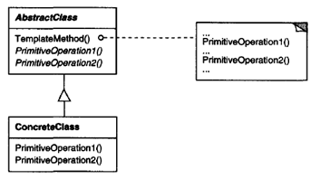
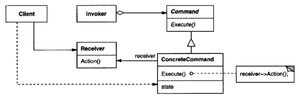
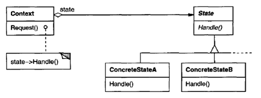

.. contents:: Table of Contents

Behavioral Patterns
===================

Behavioral patterns are concerned with algorithms and the assignment of responsibilities between objects.

Behavioral patterns describe not just patterns of objects or classes but also the patterns of communication between them. 

These patterns characterize complex control flow that's difficult to follow at run time.

Behavioral Class Patterns
------------------------

Behavioral class patterns use inheritance to distribute behavior between classes.

1. Template Method
^^^^^^^^^^^^^^^^

Template Method lets subclasses redefine certain steps of an algorithm without changing the algorithm's structure.

 
2. Interpreter
^^^^^^^^^^^^^^^^

Behavioral Object Patterns
----------------------

Behavioral object patterns use object composition rather than inheritance. Some describe how a group of peer objects cooperate to perform a task that no single object can carry out by itself.

An important issue here is how peer objects know about each other. Peers could maintain explicit references to each other, but that would increase their coupling. In the extreme, every object would know about every other.

3. Chain of responsibility
^^^^^^^^^^^^^^^^^

4. Command
^^^^^^^^^

Encapsulate a request as an object, thereby letting you parameterize clients with different requests, queue or log requests, and support undoable operations.

 
5. Iterator
^^^^^^^^^

6. Mediator
^^^^^^^^^^

7. Memento
^^^^^^^^^

8. Observer
^^^^^^^^^^

9. State
^^^^^^^

Allow an object to alter its behavior when its internal state changes. The object will appear to change its class.

 
10. Strategy
^^^^^^^^^

11. Visitor
^^^^^^^^^^

Discussion of Behavioral Patterns
----------------------------

Encapsulating Variation
^^^^^^^^^^^^^^^^^^
When an aspect of a program changes frequently, these patterns define an object that encapsulates that aspect. Then other parts of the program can collaborate with the object whenever they depend on that aspect. The patterns usually define an abstract class that describes the encapsulating object, and the pattern derives its name from that object. For example

- a State object encapsulates a state-dependent behavior (State Pattern)
- an Iterator object encapsulates the way you access and traverse the components of an aggregate object (Iterat Pattern)

These patterns describe aspects of a program that are likely to change. 

Most patterns have two kinds of objects: the new object(s) that encapsulate the aspect, and the existing object(s) that use the new ones. Usually the functionality of new objects would be an integral part of the existing objects were it not for the pattern.

But not all object behavioral patterns partition functionality like this. For example, Chain of Responsibility

Objects as Arguments
^^^^^^^^^^^^

Several patterns introduce an object that's always used as an argument. For example, Visitor.

Other patterns define objects that act as magic tokens to be passed around and invoked at a later time. For example, Command and Memento.

In Command, the token represents a request; 

in Memento, the token represents the internal state of an object at a particular time.

In both cases, the token can have a complex internal representation, but the client is never aware of it.

Should Communication be Encapsulated or Distributed?
^^^^^^^^^^^^^^^^^^^^^^^^^^

Mediator and Observer are competing patterns. Observer distributes communication by introducing Observer and Subject objects, whereas a Mediator object encapsulates the communication between other objects.

It's easier to make reusable Observers and Subjects than to make reusable Mediators. The Observer pattern promotes partitioning and loose coupling between Observer and Subject, and that leads to finer-grained classes that are more apt to be reused.

On the other hand, it's easier to understand the flow of communication in Mediator than in Observer.

Observers in Smalltalk can be parameterized with messages to access the Subject state, and so they are even more reusable than they are in C++. This makes Observer more attractive than Mediator in Smalltalk. Thus, a Smalltalk programmer will often use Observer where a C++ programmer would use Mediator.

Decoupling Senders and Receivers
^^^^^^^^^^^^^^^^^^^^^^^^^^^^^^

When collaborating objects refer to each other directly, they become dependent on each other, and that can have an adverse impact on the layering and reusability of a system.

The Command pattern supports decoupling by using a Command object to define the binding between a sender and receiver.

The Command object provides a simple interface for issuing the request (that is, the Execute operation). Defining the sender-receiver connection in a separate object lets the sender work with different receivers. It keeps the sender decoupled from the receivers, making senders easy to reuse.

Summary
^^^^^^^^^^

With few exceptions, behavioral design patterns complement and reinforce each other. An iterator can traverse an aggregate, and a visitor can apply an operation to each element in the aggregate.

Behavioral patterns work well with other patterns, too. For example, a system that uses the Composite pattern might use a visitor to perform operations on components of the composition.
It could use the Observer pattern to tie one object structure to another and the State pattern to let a component change its behavior as its state changes.
The composition itself might be created using the approach in Builder, and it might be treated as a Prototype by some other part of the system.

Well-designed object-oriented systems are just like this—they have multiple patterns embedded in them—but not because their designers necessarily thought in these terms. Composition at the pattern level rather than the class or object levels lets us achieve the same synergy with greater ease.

References
------------

Book: Design Patterns Elements of Reusable Object-Oriented Software

