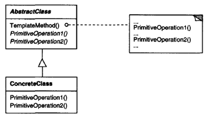

.. contents:: Table of Contents

Template Method
===============

Intent
------

Template Method lets subclasses redefine certain steps of an algorithm without changing the algorithm's structure.

Motivation
-----------

Consider an application framework that provides Application and Document classes. The Application class is responsible for opening existing documents stored in an external format, such as a file. A Document object represents the information in a document once it's read from the file.
 
The abstract Application class defines the algorithm for opening and reading a document in its OpenDocument operation:

.. code:: cpp

        void Application::OpenDocument (const char* name) {

            if (!CanOpenDocument(name)) {
                // cannot handle this document
                return;
            }

            Document* doc = DoCreateDocument();
            if (doc ) {
                _docs->AddDocument(doc);
                AboutToOpenDocument(doc);
                doc->Open();
                doc->DoRead();
            }

        }

We call **OpenDocument a template method**. A template method defines an algorithm in terms of abstract operations that subclasses override to provide concrete behavior. 

Application subclasses define the steps of the algorithm that check if the document can be opened (CanOpenDocument) and that create the Document (DoCreateDocument). 

Document classes define the step that reads the document (DoRead). The template method also defines an operation that lets Application subclasses know when the document is about to be opened (AboutToOpenDocument), in case they care.

By defining some of the steps of an algorithm using abstract operations, the template method fixes their ordering, but it lets Application and Document subclasses vary those steps to suit their needs.

Applicability
-------------

Template Method pattern should be used

- to implement the invariant parts of an algorithm once and leave it up to subclasses to implement the behavior that can vary
- to control subclasses extensions. You can define a template method that calls "hook" operations (see Consequences) at specific points, thereby permitting extensions only at those points.

Strurture
-----------

Participants
-------------

**AbstractClass (Application)**

defines abstract primitive operations that concrete subclasses define to implement steps of an algorithm

implements a template method defining the skeleton of an algorithm. The template method calls primitive operations as well as operations defined in AbstractClass or those of other objects

**ConcreteClass (MyApplication)**

implements the primitive operations to carry out subclass-specific stepsof the algorithm

Collaborations
-------------

ConcreteClass relies on AbstractClass to implement the invariant steps of the algorithm.

Consequences
-----------

Template methods are a fundamental technique for code reuse. They are particularly important in class libraries.

Template methods lead to an inverted control structure that's sometimes referred to as "the Hollywood principle," that is, "Don' t call us, we'll call you". This refers to how a parent class calls the operations of a subclass and not the other way around.

Template methods call the following kinds of operations:

- concrete operations (either on the ConcreteClass or on client classes);
- concrete AbstractClass operations (i.e., operations that are generally useful to subclasses);
- primitive operations (i.e., abstract operations);
- factory methods; and
- **hook operations**, which provide default behavior that subclasses can extend if necessary. A hook operation often does nothing by default.

It's important for template methods to specify which operations are hooks (may be overridden) and which are abstract operations (must be overridden).

A subclass can extend a parent class operation's behavior by overriding the operation and calling the parent operation explicitly.

.. code:: cpp

        void DerivedClass::Operation() {
            ParentClass::Operation();
            // DerivedClass extended behavior
        }

Unfortunately, it's easy to forget to call the inherited operation. We can transform such an operation into a template method to give the parent control over how subclasses extend it. 

The idea is to call a **hook operation** from a template method in the parent class. Then subclasses can then override this hook operation:

HookOperation does nothing in ParentClass:

.. code:: cpp

	void ParentClass::HookOperation () { }

Subclasses override HookOperation to extend its behavior:

.. code:: cpp

	void DerivedClass::HookOperation ( ) {
		// derived class extension
	}

Implementation
--------------

Three implementation issues are worth noting:

1.	Using C++ access control
^^^^^^^^^^^^^^^^^^^^^^^^^^^^

In C++, the primitive operations that a template method calls can be declared protected members. This ensures that they are only called by the template method. 

**Primitive operations** that must be overridden are **declared pure virtual**. 

The **template method itself should not be overridden**; therefore you can make the template method a nonvirtual member function.

2.	Minimizing primitive operations
^^^^^^^^^^^^^^^^^^

Minimize the number of primitive operations. The more operations that need overriding, the more tedious things get for clients.

3.	Naming conventions
^^^^^^^^^^^^^^^^^^^

You can identify the operations that should be overridden by adding a prefix to their names

Sample Code
-----------

`Template Method Pattern code file <03_Behavioral_Patterns_02_TemplateMethod.cpp>`_

.. code:: cpp

        #include <iostream>
        #include <vector>

        class Sort {

            protected :

            virtual void readData(std::vector<int> & ) { }       // hook operation
            virtual void writeData(std::vector<int> & vec)    {    // primitive operation
                for(auto & elem : vec) {
                    std::cout << elem << ' ';
                }
            }
            virtual void sortData(std::vector<int> & vec) =   0;    // primitive operation

            void swap(int & a, int & b) {
                int temp = a;
                a = b;
                b = temp;
            }

            public:
            virtual void processData(std::vector<int> & vec) final {
                readData(vec);
                std::cout << "Before sort: ";
                writeData(vec);
                std::cout << '\n';
                sortData(vec);
                std::cout << "After sort: ";
                writeData(vec);
                std::cout << '\n';
            }
        };

        class SelectionSort : public Sort {
            virtual void readData(std::vector<int> & vec) { 
                for(int i = 1; i < 10; ++i) {
                    vec.push_back(10-i);
                }    
            }
            
            virtual void sortData(std::vector<int> & vec) {
                size_t i, j, min_idx;
                size_t  n = vec.size();
                // One by one move boundary of unsorted subarray
                for (i = 0; i < n-1; i++) {
                    
                    // Find the minimum element in unsorted array
                    min_idx = i;
                    for (j = i+1; j < n; j++)
                        if (vec[j] < vec[min_idx])
                            min_idx = j;
                            
                    // Swap the found minimum element with the first element
                    swap(vec[min_idx], vec[i]);
                }

            }
        };

        class BubbleDescendingSort : public Sort {
            virtual void readData(std::vector<int> & vec) { 
                for(int i = 1; i < 10; ++i) {
                    vec.push_back(i);
                }    
            }
            
            virtual void sortData(std::vector<int> & vec) {
                size_t i, j;
                size_t  n = vec.size();
                for (i = 0; i < n-1; i++) {
                    // Last i elements are already in place
                    for (j = 0; j < n-i-1; j++) {
                        if (vec[j] < vec[j+1])
                            swap(vec[j], vec[j+1]);
                    }
                }
            }
        };

        int main() {
            std::vector<int> vec;

            Sort * sort = nullptr;

            std::cout << "Selection sort: \n";
            SelectionSort sel_sort;
            sort = &sel_sort;
            sort->processData(vec);

            vec.clear();

            std::cout << "Bubble descending sort: \n";
            BubbleDescendingSort bub_sort;
            sort = &bub_sort;
            sort->processData(vec);

            return 0;
        }

Output::

        Selection sort: 
        Before sort: 9 8 7 6 5 4 3 2 1 
        After sort: 1 2 3 4 5 6 7 8 9 
        Bubble descending sort: 
        Before sort: 1 2 3 4 5 6 7 8 9 
        After sort: 9 8 7 6 5 4 3 2 1

Known Uses
----------

They can be found in almost every abstract class.

Related Patterns
---------------

Factory Methods are often called by template methods. In the Motivation example, the factory method DoCreateDocument() is called by the template method OpenDocument.

Strategy: Template methods use inheritance to vary part of an algorithm. Strategies use delegation to vary the entire algorithm.

References
----------

| Book: Design Patterns Elements of Reusable Object-Oriented Software
| http://www.modernescpp.com/index.php/the-template-method

