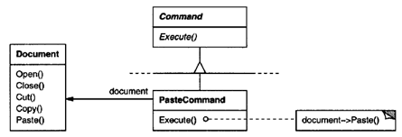
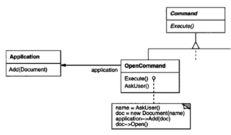
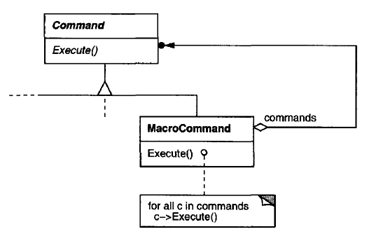
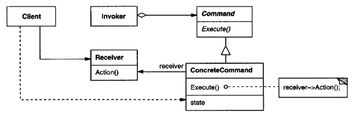
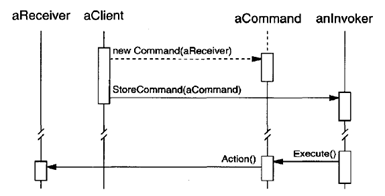

.. contents:: Table of Contents

Command
========

Intent
------

Encapsulate a request as an object, thereby letting you parameterize clients with different requests, queue or log requests, and support undoable operations.

Also Known As
------------

Action, Transaction

Motivation
----------

Sometimes it's necessary to issue requests to objects without knowing anything about the operation being requested or the receiver of the request. For example, user interface toolkits include objects like buttons and menus that carry out a request in response to user input.

The Command pattern lets toolkit objects make requests of unspecified application objects by turning the request itself into an object. This object can be stored and passed around like other objects.

The key to this pattern is an abstract Command class, which declares an interface for executing operations. In the simplest form this interface includes an abstract Execute operation. 

Concrete Command subclasses specify a receiver-action pair by storing the receiver as an instance variable and by implementing Execute to invoke the request. The receiver has the knowledge required to carry out the request.

Menus can be implemented easily with Command objects. Each choice in a Menu is an instance of a Menultem class. An Application class creates these menus and their menu items along with the rest of the user interface. The Application class also keeps track of Document objects that a user has opened. 

When the user selects a Menultem, the Menultem calls Execute on its command, and Execute carries out the operation. Menultems don't know which subclass of Command they use. Command subclasses store the receiver of the request and invoke one or more operations on the receiver.

For example, PasteCommand supports pasting text from the clipboard into a Document. PasteCommand's receiver is the Document object it is supplied upon instantiation. The Execute operation invokes Paste on the receiving Document.

OpenCommand's Execute operation is different: it prompts the user for a document name, creates a corresponding Document object, adds the document to the receiving application, and opens the document.

 
Sometimes a Menultem needs to execute a sequence of commands. MacroCommand is a concr eteCommand subcla ss that simply executes a sequence of Commands. MacroComma ndhas no explicit receiver, because the commands it sequences define their own receiver.

In each ofthes e example s, notice how the Command pattern decouples the object that invokes the operation from the one having the knowledge to perform it. This gives us a lot of flexibility in designing our user interface.

Applicability
-------------

Use the Command pattern when you want to

- Parameterize objects by an action to perform, as Menultem objects did above. You can express such parameterization in a procedural language with a callback function, that is, a function that's registered somewhere to be called at a later point. Commands are an object-oriente d replacement for callbacks.

- Specify, queue, and execute requests at different times.

- Support undo. The Command's Execute operation can store state for reversing its effects in the command itself.

- Support logging changes, you can keep a persistent log of changes. Recovering from a crash involves reloading logged commands from disk and reexecuting them with the Execute operation.

- Structure a system around high-level operations built on primitives operations. Such a structure is common in information systems that support transactions. A transaction encapsulates a set of changes to data. The Command pattern offers a way to model transactions. Commands have a common interface, letting you invoke all transactions the same way. The pattern also makes it easy to extend the system with new transactions.

Structure
----------

 
Participants
-----------

**Command**

    declares an interface for executing an operation.

**ConcreteCommand (PasteCommand, OpenCommand)**

    defines a binding between a Receiver object and an action.
    
    implements Execute by invoking the corresponding operation(s) on Receiver.

**Client (Application)**

    creates a ConcreteCommand object and sets its receiver.

**Invoker (Menultem)**

    asks the command to carry out the request.

**Receiver (Document, Appplication)**

    knows how to perform the operations associated with carrying out a request. Any class may serve as a Receiver.

Collaborations
--------------

- The client creates a ConcreteCommand object and specifies its receiver.

- An Invoker object stores the ConcreteCommand object.

- The invoker issues a request by calling Execute on the command. When commands are undoable, ConcreteCommand stores state for undoing the command prior to invoking Execute.

- The ConcreteCommand object invokes operations on its receiver to carry out the request.

The following diagram shows the interactions between these objects. It illustrates how Command decouples the invoker from the receiver (and the request it carries out).

 
Consequences
--------------

The Command pattern has the following consequences:

- Command decouples the object that invokes the operation from the one that knows how to perform it.

- Commands are first-class objects. They can be manipulated and extended like any other object.

- You can assemble commands into a composite command. An example is the MacroCommand class described earlier.

- It's easy to add new Commands, because you don't have to change existing classes.

Implementation
--------------

Consider the following issues when implementing the Command pattern: 

Consider the following issues when implementing the Command pattern: 

1.	How intelligent should a command be? 
^^^^^^^^^^^^^^^^^^^^^^^^

A command can have a wide range of abilities. At one extreme it merely defines a binding between a receiver and the actions that carry out the request. At the other extreme it implements everything itself without delegating to a receiver at all.

2.	Supporting undo and redo
^^^^^^^^^^^^^^^^^^^^^^^^^

Commands can support undo and redo capabilities if they provide a way to reverse their execution (e.g., an Unexecute or Undo operation). A ConcreteCommand class might need to store additional state to do so. This state can include

- The Receiver object, which actually carries out operations in response to the request,
- The arguments to the operation performed on the receiver, and
- Any original values in the receiver that can change as a result of handling the request. The receiver must provide operations that let the command return the receiver to its prior state.

3.	Avoiding error accumulation in the undo process
^^^^^^^^^^^^^^^^^^^^^^^^^^^^^^^^^^^^^^^^^^^^^

Errors can accumulate, as commands are executed, unexecuted, and re-executed repeatedly so that an application's state eventually diverges from original values. It may be necessary therefore to store more information in the command to ensure that objects are restored to their original state. The Memento pattern can be applied to give the command access to this information without exposing the internals of other objects.

4.	Using C++ templates
^^^^^^^^^^^^^^^^^^^^^^^^^^^

For commands that (1) aren't undoable and (2) don't require arguments, we can use C++ templates to avoid creating a Command subclass for every kind of action and receiver.

Sample Code
-----------

`Command Pattern code file <03_Behavioral_Patterns_04_Command.cpp>`_

.. code:: cpp

        #include <iostream>
        #include <vector>
        #include <algorithm>
        #include <memory>

        class Document {
            public:
            virtual ~Document() {}
            virtual void open()         = 0;
            virtual void close()        = 0;
            virtual void copy()         = 0;
            virtual void paste()        = 0;
        };

        class TextDocument : public Document {
            public:
            virtual ~TextDocument() { }
            virtual void open() {
                std::cout << "Text Document open operation\n";
            }
            virtual void close() {
                std::cout << "Text Document close operation\n";
            }
            virtual void copy() {
                std::cout << "Text Document copy operation\n";
            } 
            virtual void paste() {
                std::cout << "Text Document paste operation\n";
            }        
        };

        class GraphicDocument : public Document {
            public:
            virtual ~GraphicDocument() { }
            virtual void open() {
                std::cout << "Graphic Document open operation\n";
            }
            virtual void close() {
                std::cout << "Graphic Document close operation\n";
            }
            virtual void copy() {
                std::cout << "Graphic Document copy operation\n";
            } 
            virtual void paste() {
                std::cout << "Graphic Document paste operation\n";
            }     
        };

        class Command {
            public:
                virtual ~Command() {}
                virtual void execute()  = 0;
        };

        class OpenCommand : public Command {
            Document    *m_doc;
            public:
            virtual ~OpenCommand()  { }
            OpenCommand(Document * doc) : m_doc(doc) {}
            virtual void execute() {
                m_doc->open();
            }
        };

        class CloseCommand : public Command {   
            Document        *m_doc;
            public:
            virtual ~CloseCommand() { }
            CloseCommand(Document * doc) : m_doc(doc) {}
            virtual void execute() {
                m_doc->close();
            }
        };

        class CopyCommand : public Command {   
            Document        *m_doc;
            public:
            virtual ~CopyCommand() { }
            CopyCommand(Document * doc) : m_doc(doc) {}
            virtual void execute() {
                m_doc->copy();
            }
        };

        class PasteCommand : public Command {   
            Document        *m_doc;
            public:
            virtual ~PasteCommand() { }
            PasteCommand(Document * doc) : m_doc(doc) {}
            virtual void execute() {
                m_doc->paste();
            }
        };

        template<class Receiver> 
        class SimpleCommand : public Command {
            typedef void (Receiver::*Action)();
            Receiver    *m_recv;
            Action      m_act;
            public:  
                virtual ~SimpleCommand()    { }
                SimpleCommand(Receiver * recv, Action act) :
                    m_recv(recv), m_act(act) { }
                virtual void execute() {
                    (m_recv->*m_act)();
                }
        };

        class Zoom {
            public:
            void zoomIn() {
                std::cout << "Zoom In\n";
            }
            void zoomOut() {
                std::cout << "Zoom Out\n";
            }    
        };

        class MacroCommand : public Command {
            std::vector<Command *>  m_list_cmd;
            public:
            virtual ~MacroCommand() { }

            virtual void add(Command * cmd) { 
                m_list_cmd.push_back(cmd); 
            }
            virtual void remove(Command * cmd) {
                std::remove(m_list_cmd.begin(), m_list_cmd.end(), cmd);
            }    
            virtual void execute() {
                for(auto & elem : m_list_cmd) {
                    elem->execute();
                }
            }
        };

        class CommandInvoker {
            Command * m_cmd;
            public:
            void set(Command * cmd) { m_cmd = cmd; }
            void execute() { m_cmd->execute(); }
        };

        int main() {

            {
                std::cout << "=== For Text Document ===\n";

                CommandInvoker cmd_invoker;

                std::unique_ptr<Document> text_doc = std::make_unique<TextDocument>();
                
                std::unique_ptr<Command> open_cmd = std::make_unique<OpenCommand>(text_doc.get());
                cmd_invoker.set(open_cmd.get());
                cmd_invoker.execute();
                
                auto simp_zoom_cmd = std::make_shared<Zoom>();
                std::unique_ptr<Command> zoom_in_cmd = std::make_unique<SimpleCommand<Zoom>>(simp_zoom_cmd.get(), &Zoom::zoomIn);
                cmd_invoker.set(zoom_in_cmd.get());
                cmd_invoker.execute();

                std::unique_ptr<Command> zoom_out_cmd = std::make_unique<SimpleCommand<Zoom>>(simp_zoom_cmd.get(), &Zoom::zoomOut);
                cmd_invoker.set(zoom_out_cmd.get());
                cmd_invoker.execute();

                std::unique_ptr<Command> copy_cmd = std::make_unique<CopyCommand>(text_doc.get());
                std::unique_ptr<Command> paste_cmd = std::make_unique<PasteCommand>(text_doc.get());

                auto macro_cmd = std::make_shared<MacroCommand>();
                macro_cmd->add(copy_cmd.get());
                macro_cmd->add(paste_cmd.get());
                cmd_invoker.set(macro_cmd.get());
                cmd_invoker.execute();

                std::unique_ptr<Command> close_cmd = std::make_unique<CloseCommand>(text_doc.get());
                cmd_invoker.set(close_cmd.get());
                cmd_invoker.execute();        
            }
            
            {
                std::cout << "\n=== For Graphic Document ===\n";

                CommandInvoker cmd_invoker;

                std::unique_ptr<Document> graph_doc = std::make_unique<GraphicDocument>();
                
                std::unique_ptr<Command> open_cmd = std::make_unique<OpenCommand>(graph_doc.get());
                cmd_invoker.set(open_cmd.get());
                cmd_invoker.execute();
                
                auto simp_zoom_cmd = std::make_shared<Zoom>();
                std::unique_ptr<Command> zoom_in_cmd = std::make_unique<SimpleCommand<Zoom>>(simp_zoom_cmd.get(), &Zoom::zoomIn);
                cmd_invoker.set(zoom_in_cmd.get());
                cmd_invoker.execute();

                std::unique_ptr<Command> zoom_out_cmd = std::make_unique<SimpleCommand<Zoom>>(simp_zoom_cmd.get(), &Zoom::zoomOut);
                cmd_invoker.set(zoom_out_cmd.get());
                cmd_invoker.execute();

                std::unique_ptr<Command> copy_cmd = std::make_unique<CopyCommand>(graph_doc.get());
                std::unique_ptr<Command> paste_cmd = std::make_unique<PasteCommand>(graph_doc.get());

                auto macro_cmd = std::make_shared<MacroCommand>();
                macro_cmd->add(copy_cmd.get());
                macro_cmd->add(paste_cmd.get());
                cmd_invoker.set(macro_cmd.get());
                cmd_invoker.execute();

                std::unique_ptr<Command> close_cmd = std::make_unique<CloseCommand>(graph_doc.get());
                cmd_invoker.set(close_cmd.get());
                cmd_invoker.execute();
            }

            return 0;
        }

Output::

        === For Text Document ===
        Text Document open operation
        Zoom In
        Zoom Out
        Text Document copy operation
        Text Document paste operation
        Text Document close operation

        === For Graphic Document ===
        Graphic Document open operation
        Zoom In
        Zoom Out
        Graphic Document copy operation
        Graphic Document paste operation
        Graphic Document close operation

Known Uses
-----------

Perhaps the first example of the Command pattern appears in a paper by Lieberman. MacApp popularized the notion of commands for implementing undoable operations.

The THINK class library also uses commands to support undoable actions. Commands in THINK are called "Tasks." Task obje ctsare passed along a Chain of Responsibility for consumption.

Coplien describes how to implement functors, objects that are functions, in C++. He achieves a degree of transparency in their use by overloading the function call operator (operator ()) . The Command pattern is different; its focus is on maintaining a binding between a receiver and a function (i. e. , action), not just maintaining a function.

Related Patterns
----------------

A Composite can be used to implement MacroCommands.
A Memento can keep state the command requires to undo its effect.
A command that must be copied before being placed on the history list acts as a Prototype.

References
-----------

| Book: Design Patterns Elements of Reusable Object-Oriented Software
| https://www.digitalocean.com/community/tutorials/command-design-pattern

