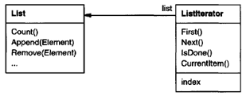
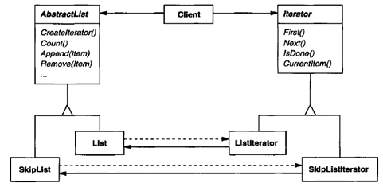
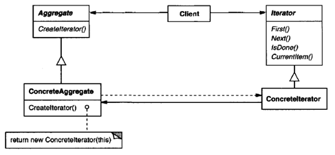

.. contents:: Table of Contents

Iterator
========

Intent
-------

Provide a way to access the elements of an aggregate object sequentially without exposing its underlying representation.

Also Known As
-----------

Cursor

Motivation
--------

An aggregate object such as a list should give you a way to access its elements without exposing its internal structure. Moreover, you might want to traverse the list in different ways, depending on what you want to accomplish.

The key idea in this pattern is to take the responsibility for access and traversal out of the list object and put it in to an iterator object. The Iterator class defines an interface for accessing the list's elements.

 
Before you can instantiate Listlterator, you must supply the List to traverse. Once you have the Listlterator instance, you can access the list's elements sequentially.

Separating the traversal mechanism from the List object lets us define iterators for different traversal policies without enumerating them in the List interface.

It would be better if we could change the aggregate class without changing client code. We can do this by generalizing the iterator concept to support **polymorphic iteration**.

We define an AbstractList class that provides a common interface for manipulating lists. Similarly, we need an abstract Iterator class that defines a common iteration interface. Then we can define concrete Iterator subclasses for the different list implementations. As a result, the iteration mechanism becomes independent of concrete aggregate classes.

 
Since we want to write code that's independent of the concrete List subclasses, we cannot simply instantiate a specific class. Instead, we make the list objects responsible for creating their corresponding iterator. This requires an operation like Createlterator through which clients request an iterator object.

Createlterator is an example of a factory method. The Factory Method approach give rise to two class hierarchies, one for lists and another for iterators. The Createlterator factory method "connects" the two hierarchies.

Applicability
----------

Use the Iterator pattern

- to access an aggregate object's contents without exposing its internal representation.
- to support multiple traversals of aggregate objects.
- to provide a uniform interface for traversing different aggregate structures (that is, to support polymorphic iteration).

Structure
--------

 

Participants
------------

**Iterator**

defines an interface for accessing and traversing elements.

**Concretelterator**

implements the Iterator interface.

keeps track of the current position in the traversal of the aggregate.

**Aggregate**

defines an interface for creating an Iterator object.

**ConcreteAggregate**

implements the Iterator creation interface to return an instance of the proper Concretelterator.

Collaborations
-------------

A Concretelterator keeps track of the current object in the aggregate and can compute the succeeding object in the traversal.

Consequences
-----------

The Iterator pattern has three important consequences:

**1.	It supports variations in the traversal of an aggregate**. Iterators make it easy to change the traversal algorithm: Just replace the iterator instance with a different one. You can also define Iterator subclasses to support new traversals.

**2.	Iterators simplify the Aggregate interface**. Iterator's traversal interface obviates the need for a similar interface in Aggregate, thereby simplifying the aggregate's interface.

**3.	More than one traversal can be pending on an aggregate**. An iterator keeps track of its own traversal state. Therefore, you can have more than one traversal in progress at once.

Implementation
-------------

Iterator has many implementation variants and alternatives. Some important ones follow.

1.	Who controls the iteration?
^^^^^^^^^^^^^^^^^^^^^^^^^^

**external iterator:** client controls the iteration

**internal iterator:** iterator controls the iteration

Clients that use an external iterator must advance the traversal and request the next element explicitly from the iterator.  In contrast, the client hands an internal iterator an operation to perform, and the iterator applies that operation to every element in the aggregate.

External iterators are more flexible than internal iterators. It's easy to compare two collections for equality with an external iterator, for example, but it's practically impossible with internal iterators. Internal iterators are especially weak in a language like C++. Internal iterators are easier to use, because they define the iteration logic for you.

2.	Who defines the traversal algorithm? 
^^^^^^^^^^^^^^^^^^^^^^^^^^^^

The aggregate might define the traversal algorithm and use the iterator to store just the state of the iteration. We call this kind of iterator a **cursor**, since it merely points to the current position in the aggregate. A client will invoke the Next operation on the aggregate with the cursor as an argument, and the Next operation will change the state of the cursor.

If the iterator is responsible for the traversal algorithm, then it's easy to use different iteration algorithms on the same aggregate, and it can also be easier to reuse the same algorithm on different aggregates. On the other hand, the traversal algorithm might need to access the private variables of the aggregate. If so, **putting the traversal algorithm in the iterator violates the encapsulation of the aggregate**.

3.	How robust is the iterator?
^^^^^^^^^^^^^^^^^^^^^^^^^^^^^^

It can be dangerous to modify an aggregate while you're traversing it. A simple solution is to copy the aggregate and traverse the copy, but that's too expensive to do in general.

**A robust iterator ensures that insertions and removals won't interfere with traversal, and it does it without copying the aggregate**. On insertion or removal, the aggregate either adjusts the internal state of iterators it has produced, or it maintains information internally to ensure proper traversal.

4.	Additional Iterator operations
^^^^^^^^^^^^^^^^^^^^^^^^^^

The minimal interface to Iterator consists of the operations First, Next, IsDone, and Currentltem. Some additional operations might prove useful. For example, ordered aggregates can have a Previous operation that positions the iterator to the previous element.

5.	Using polymorphic iterators in C++
^^^^^^^^^^^^^^^^^^^^^^^^^^^^^^^^^^^^^^^^^^

They require the iterator object to be allocated dynamically by a factory method. Hence, they should be used only when there's a need for polymorphism. Another drawback: the client is responsible for deleting them.
The Proxy pattern provides a remedy. We can use a stack-allocated proxy as a stand-in for the real iterator. The proxy deletes the iterator in its destructor. This is an application of the well-known C++ technique "resource allocation is initialization (RAII)".

6.	Iterators may have privileged access
^^^^^^^^^^^^^^^^^^^^^^^^^^^^^^^^^^^^^^^

The iterator and the aggregate are tightly coupled. We can express this close relationship in C++ by making the iterator a friend of its aggregate.

**Drawback:** It'll require changing the aggregate interface to add another friend to define new traversals.

To avoid this problem, the Iterator class can include protected operations for accessing important but publicly unavailable members of the aggregate. Iterator subclasses (and only Iterator subclasses) may use these protected operations to gain privileged access to the aggregate.

7.	Iterators for composites
^^^^^^^^^^^^^^^^^^^^

Composites often need to be traversed in more than one way. Preorder, postorder, inorder, and breadth-first traversals are common. You can support each kind of travers alwith a different class of iterator.

External iterators can be difficult to implement over recursive aggregate structures like those in the Composite pattern.

If the nodes in a Composite have an interface for moving from a node to its siblings, parents, and children, then a cursor-based iterator may offer a better alternative. The cursor only needs to keep track of the current node; it can rely on the node interface to traverse the Composite.

8.	Null iterators
-------------------

A Nulllterator is a degenerate iterator that's helpful for handling boundary conditions. By definition, a Nulllterator is always done with traversal; that is, its isDone() operation always evaluates to true.

At each point in the traversal, we ask the current element for an iterator for its children. Aggregate elements return a concrete iterator as usual. But leaf elements return an instance of Nulllterator.

Sample Code
-------------

1.	List and Iterator interfaces

2.	Iterator subclass implementations

3.	Using the iterators

4.	Avoiding commitment to a specific list implementation

	We can introduce an AbstractList class to standardize the list interface for different list implementations.

	To enable polymorphic iteration, AbstractList defines a factory method Createlterator, which subclasses override to return their corresponding iterator.

5.	Making sure iterators get deleted

	We'll provide an IteratorPtr that acts as a proxy for an iterator. It takes care of cleaning up the Iterator object when it goes out of scope. IteratorPtr is always allocated on the stack.

6.	An internal Listlterator

	The iterator controls the iteration, and it applies an operation to each element.

	Two options:

    **a.	Pass in a pointer to a function (global or static):** the iterator calls the operation passed to it at each point in the iteration

    **b.	Rely on subclassing:** the iterator calls an operation that a subclass overrides to enact specific behavior.

	Neither option is perfect. functions aren't well-suited to accumulate state during the iteration. We would have to use static variables to remember the state.

	Internally it uses an external Listlterator to do the traversal.

	Internal iterators can encapsulate different kinds of iteration.

**Other Examples**

`Iterator Pattern - Simple code file <03_Behavioral_Patterns_05_Iterator_Simple.cpp>`_

`Iterator Pattern - Polymorphic Iterator With Proxy code file <03_Behavioral_Patterns_05_Iterator_PolymorphicIteratorWithProxy.cpp>`_

`Iterator Pattern - Internal Iterator code file <03_Behavioral_Patterns_05_Iterator_InternalIterator.cpp>`_

.. code:: cpp

        // A simple Iterator Design – External Iterator
        #include <iostream>
        #include <stdexcept>
        #include <sstream>

        template<typename T>
        class MyList {
            T           m_arr[100];
            size_t      m_size;
            public:
            MyList(size_t list_size, T val) : m_size(list_size)  {
                for(size_t i = 0; i < list_size; ++i) {
                    m_arr[i] = val;
                }
            }
            size_t  size() const { return m_size; }
            T      get(size_t index) const { return m_arr[index]; }
        };

        // Iterator interface
        template<typename T>
        class MyIteratorInterface {
            public:
            virtual ~MyIteratorInterface() {}
            virtual void begin()        = 0;
            virtual void next()         = 0;
            virtual bool done() const   = 0;
            virtual T    cur_item() const  = 0;
        };

        // Iterator subclass implementations
        template<typename T>
        class MyListIterator : public MyIteratorInterface<T> {
            const MyList<T> & m_list;
            size_t          m_index;
            public:
            virtual ~MyListIterator() { }
            MyListIterator(const MyList<T> & list) 
                : m_list(list), m_index(0) { }
            virtual void begin()        { m_index = 0; };
            virtual void next()         { ++m_index; }
            virtual bool done() const   { return m_index >= m_list.size(); }
            virtual T    cur_item() const  {
                if(done()) {
                    std::stringstream sstm ;
                    sstm << "Index " << m_index << " is out of range";
                    throw std::out_of_range(sstm.str());
                }
                return m_list.get(m_index); 
            };        
        };

        template<typename T>
        class MyReverseListIterator : public MyIteratorInterface<T> {
            const MyList<T> & m_list;
            size_t          m_index;
            public:
            virtual ~MyReverseListIterator() { }
            MyReverseListIterator(const MyList<T> & list) 
                : m_list(list), m_index(0) { }
            virtual void begin()        { m_index = m_list.size(); };
            virtual void next()         { --m_index; }
            virtual bool done() const   { return m_index == 0; }
            virtual T    cur_item() const  {
                if(done()) {
                    std::stringstream sstm ;
                    sstm << "Index " << m_index << " is out of range";
                    throw std::out_of_range(sstm.str());
                }        
                return m_list.get(m_index-1); 
            };        
        };

        // Using the iterators
        void printListInt(MyIteratorInterface<int> & it_list) {
            for(it_list.begin(); ! it_list.done(); it_list.next()) {
                std::cout << it_list.cur_item() << ' ';
            }
            std::cout << '\n';
        }

        int main() {

            MyList<int> ilist(5, 4);

            MyListIterator<int>  fwd_it(ilist);
            printListInt(fwd_it);

            MyReverseListIterator<int>  rev_it(ilist);
            printListInt(rev_it);

            return 0;
        }

Output::

        4 4 4 4 4 
        4 4 4 4 4

Known Uses
---------

Iterators are common in object-oriented systems. Most collection class libraries offer iterators in one form or another.

Related Patterns
---------------

Composite: Iterators are often applied to recursive structures such as Composites.

Factory Method: Polymorphic iterators rely on factory methods to instantiate the appropriate Iterator subclass.

Memento is often used in conjunction with the Iterator pattern. An iterator can use a memento to capture the state of an iteration. The iterator stores the memento internally.

References
-----------

Book: Design Patterns Elements of Reusable Object-Oriented Software

